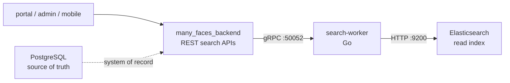

# Many Faces Elastic

<!-- readme-badges:start -->

[](./VERSION)


[](https://github.com/01laky/many_faces_main/actions/workflows/ci.yml)


<!-- readme-badges:end -->

**Version:** [`0.6.1`](./VERSION) · [Changelog](./CHANGELOG.md)

**Author:** Ladislav Kostolny · [01laky@gmail.com](mailto:01laky@gmail.com)

> **Optional search tier for Many Faces AI.** Packages a dev Elasticsearch node plus a Go gRPC search-worker. The backend talks to the worker; clients never touch Elasticsearch directly. **PostgreSQL is authoritative** — Elasticsearch is a read projection only. Disable with `ENABLE_ELASTICSEARCH=0`.

**Canonical repository:** [github.com/01laky/many_faces_elastic](https://github.com/01laky/many_faces_elastic)

---

## Quick Start

```bash
# Full stack (Elasticsearch enabled by default)
cd many_faces_main
./scripts/start-all-dev.sh

# Standalone
cd many_faces_elastic
cp .env.example .env
./scripts/start-elasticsearch.sh

# Skip Elasticsearch entirely
ENABLE_ELASTICSEARCH=0 ./scripts/start-all-dev.sh
```

**Ports (development):**

| Endpoint           | Host              | Container |
| ------------------ | ----------------- | --------- |
| Elasticsearch HTTP | `localhost:59200` | `9200`    |
| Search-worker gRPC | `localhost:59202` | `50052`   |

---

## Architecture



**Trust boundary:** Browsers, SPAs, and the mobile app **never** call Elasticsearch or the worker gRPC directly — they only call `many_faces_backend` REST APIs.

---

## Three Pillars

| Pillar            | Highlights                                                                                                                                             |
| ----------------- | ------------------------------------------------------------------------------------------------------------------------------------------------------ |
| **Security**      | Worker **gRPC token** (`x-search-worker-token`) + optional **TLS/mTLS**; Elasticsearch not exposed to clients; backend-only integration path.          |
| **AI**            | Hosts the **`operator-ai-knowledge`** index (dense vectors + BM25) used for RAG retrieval — kNN+BM25+RRF over stat-bundle descriptors.                 |
| **Configuration** | Toggle: `ENABLE_ELASTICSEARCH=0`; host ports `59200`/`59202`; backend `SearchOptions` (`Search__Enabled`, `Search__WorkerGrpcUrl`); admin infra panel. |

---

## Components

| Component                               | Role                                                                                                    |
| --------------------------------------- | ------------------------------------------------------------------------------------------------------- |
| **Elasticsearch**                       | Stores the search index + operator-ai-knowledge vectors; HTTP on port `9200` inside the compose network |
| **search-worker** (`cmd/search-worker`) | **Only** path that calls Elasticsearch for application logic; exposes gRPC on `50052`                   |
| **many_faces_backend**                  | Calls the worker via `Grpc.Net.Client`; does not use Elasticsearch HTTP directly                        |

---

## Search RPCs (v1)

| RPC                                  | Purpose                                           |
| ------------------------------------ | ------------------------------------------------- |
| `Ping`                               | Health — Elasticsearch reachability from worker   |
| `IndexDocument` / `DeleteDocument`   | Incremental index maintenance                     |
| `BulkIndexDocuments`                 | Reconciliation batch upsert                       |
| `ListDocumentIds`                    | Orphan cleanup during reconciliation              |
| `Autocomplete`                       | Operator global search (prefix / multi_match)     |
| `IndexKnowledge` / `DeleteKnowledge` | RAG knowledge index (operator-ai-knowledge)       |
| `SemanticSearch`                     | kNN+BM25 hybrid retrieval (RRF) for RAG bundles   |
| `KnowledgeIndexStatus`               | Index doc count, model, dimension, ready/degraded |

**Index:** `manyfaces-admin-v1` (single index, `document_type` field). `operator-ai-knowledge` index for RAG vectors.

---

## Authentication and TLS

| Environment | Setup                                                                                               |
| ----------- | --------------------------------------------------------------------------------------------------- |
| **Dev**     | Optional shared secret: `SEARCH_WORKER_EXPECTED_TOKEN` on worker + `Search__WorkerAuthToken` on API |
| **TLS**     | `SEARCH_WORKER_GRPC_TLS_CERT_FILE` + `SEARCH_WORKER_GRPC_TLS_KEY_FILE` (PEM) on worker              |
| **mTLS**    | `SEARCH_WORKER_GRPC_MTLS_CLIENT_CA_FILE` to require client certificates                             |
| **Backend** | `Search__WorkerGrpcUrl=https://…` + optional CA/cert/key paths (`Search__WorkerTls*`)               |

**TLS smoke test:**

```bash
chmod +x many_faces_elastic/scripts/smoke-grpc-tls.sh
many_faces_elastic/scripts/smoke-grpc-tls.sh
```

Uses `docker-compose.tls-smoke.yml` (host ports `59210`/`59211`). Set `RUN_DOTNET_TLS_SMOKE=0` to run grpcurl only.

Full guide: [`../docs/guides/elasticsearch-grpc-tls-mtls.md`](../docs/guides/elasticsearch-grpc-tls-mtls.md)

---

## Regenerating Go Stubs

When `many_faces_proto/proto/manyfaces/search/v1/search.proto` changes:

```bash
# Docker (no local protoc required)
docker run --rm \
  -v "$(pwd)":/w \
  -v "$(pwd)/many_faces_proto":/mfproto:ro \
  -w /w golang:1.23-bookworm bash -c '
  apt-get update -qq && apt-get install -y -qq protobuf-compiler >/dev/null
  go install google.golang.org/protobuf/cmd/protoc-gen-go@v1.36.5
  go install google.golang.org/grpc/cmd/protoc-gen-go-grpc@v1.5.1
  export PATH="$PATH:$(go env GOPATH)/bin"
  mkdir -p gen
  protoc -I /mfproto/proto \
    --go_out=gen --go_opt=paths=source_relative \
    --go-grpc_out=gen --go-grpc_opt=paths=source_relative \
    manyfaces/search/v1/search.proto'

# Local (if protoc is on PATH)
make gen
# or
./scripts/regen-go-stubs.sh
```

Generated files appear under `gen/manyfaces/search/v1/`.

---

## Requirements

- **Docker + Compose v2** (required)
- **~1 GiB+ free RAM** for single-node dev Elasticsearch (512 MB JVM heap by default)
- **Go 1.23+** on host only when building outside Docker

---

## Stop

```bash
./scripts/stop-elasticsearch.sh
```

---

## Monorepo Integration

- Submodule path: `many_faces_elastic/` under `many_faces_main`
- Backend config: `Search__Enabled`, `Search__WorkerGrpcUrl` (e.g. `http://search-worker-dev:50052`), optional `Search__WorkerAuthToken`
- Full dev stack: `ENABLE_ELASTICSEARCH=1 ./scripts/start-all-dev.sh` attaches containers to `many_faces_main_dev-network`
- Monorepo guides: [`../docs/guides/elasticsearch-search-features-overview.md`](../docs/guides/elasticsearch-search-features-overview.md) · [`../docs/guides/elasticsearch-local-dev.md`](../docs/guides/elasticsearch-local-dev.md) · [`../docs/guides/admin-global-search-autocomplete.md`](../docs/guides/admin-global-search-autocomplete.md)

---

## Documentation

| Topic                        | Link                                                                                                                   |
| ---------------------------- | ---------------------------------------------------------------------------------------------------------------------- |
| **Search features overview** | [`../docs/guides/elasticsearch-search-features-overview.md`](../docs/guides/elasticsearch-search-features-overview.md) |
| **Local dev wiring**         | [`../docs/guides/elasticsearch-local-dev.md`](../docs/guides/elasticsearch-local-dev.md)                               |
| **TLS / mTLS**               | [`../docs/guides/elasticsearch-grpc-tls-mtls.md`](../docs/guides/elasticsearch-grpc-tls-mtls.md)                       |
| **Admin global search**      | [`../docs/guides/admin-global-search-autocomplete.md`](../docs/guides/admin-global-search-autocomplete.md)             |
| **RAG retrieval**            | [`../docs/guides/operator-ai-rag-retrieval.md`](../docs/guides/operator-ai-rag-retrieval.md)                           |
| **Operator notes**           | [`docs/search-stack.md`](./docs/search-stack.md)                                                                       |
| **Monorepo docs hub**        | [`../docs/README.md`](../docs/README.md)                                                                               |

---

## Licensing Note

This submodule uses the **official Elastic** image (`docker.elastic.co/elasticsearch/elasticsearch`). Elastic Stack components are subject to the **Elastic License v2** (not Apache 2.0). For strict OSS-only deployments, evaluate **OpenSearch** as an alternative.

---

## Project Status

Active optional search tier for the Many Faces AI monorepo. v0.6.0 — admin autocomplete, SearchOutbox reconciliation, operator-ai-knowledge RAG index (semantic search via kNN+BM25+RRF), TLS/mTLS smoke, and Go tests. Tracked in [`CHANGELOG.md`](./CHANGELOG.md).
